# Pay-For-API

## Overview

**Amazon Bedrock AgentCore Payments** enables AI agents to make autonomous
payments for digital services. Agents never hold private keys or require
human approval for each transaction.

This use case builds a Strands agent that autonomously pays for
metered access to an HTTP API through AgentCore Payments. The agent
signs on either the Ethereum Virtual Machine (EVM) (Base Sepolia) or
Solana (Solana Devnet), driven by the configured `PaymentInstrument`.
The seller is a minimal "Fun Facts" service deployed via AWS CDK: an
Amazon API Gateway HTTP API backed by an AWS Lambda function that
charges **$0.01** per call and accepts either network in the x402
response.

When the agent requests a fact, the seller returns HTTP 402 with a
payment requirement. The agent forwards the requirement to AgentCore
Payments' `ProcessPayment` operation and receives a signed proof. It
then retries the request with the proof attached and returns the
content. The agent is designed never to touch a private key.

Internally, AgentCore Payments manages the wallet, the signing keys,
and the on-chain settlement. Whether the `PaymentManager` is wired to
**Coinbase Developer Platform (CDP)** or **Stripe via Privy**, the
agent code is identical. The service picks the right signer from the
connector tied to the instrument.

This script is **self-contained**. It provisions a full AgentCore
Payments stack inline (§5), creates two `EMBEDDED_CRYPTO_WALLET`
instruments under the same connector (ETHEREUM + SOLANA), and deploys
the seller from a CDK stack that lives alongside it (§3). If a
`PaymentManager` and at least one `PaymentInstrument` already exist,
the script detects them in §4 and skips the inline setup.


### Use Case Details

| Information         | Details                                                               |
|:--------------------|:----------------------------------------------------------------------|
| Use case type       | Agentic HTTP API consumption with autonomous micropayment             |
| AgentCore components| Amazon Bedrock AgentCore Payments                                     |
| Wallet providers    | Coinbase CDP ✅   ·   Stripe via Privy ✅                             |
| Payment protocol    | x402 (HTTP 402 Payment Required) on the wire                          |
| Agent type          | Single                                                                |
| Agentic Framework   | Strands Agents                                                        |
| LLM model           | Anthropic Claude Sonnet 4.5 (Amazon Bedrock, `us.` inference profile) |
| Example complexity  | Intermediate                                                          |
| SDK used            | boto3                                                                 |

### Architecture

Three parties participate in every paid request:

1. **Strands agent** — the only tool it calls is `http_request`. The
   `AgentCorePaymentsPlugin` intercepts HTTP 402 responses and handles
   the payment handshake transparently.
2. **Amazon Bedrock AgentCore Payments** — receives `ProcessPayment`,
   returns a signed x402 proof using the wallet tied to the instrument
   (Coinbase CDP or Privy).
3. **Seller (CDK stack)** — AWS Lambda function behind Amazon API
   Gateway that issues the 402 challenge, verifies the proof, and
   serves the content.

Four IAM roles separate concerns operationally, following the
**principle of least privilege**: each role has only the permissions
required for its specific operation, with explicit `Deny` statements
on actions reserved for other roles:

- `AgentCorePaymentsControlPlaneRole` — manages Manager, Connector, Credential Provider
- `AgentCorePaymentsManagementRole` — manages Instrument and Session (explicit `Deny` on `ProcessPayment`)
- `AgentCorePaymentsProcessPaymentRole` — signs payments, reads Instrument and Session
- `AgentCorePaymentsResourceRetrievalRole` — assumed by AgentCore Payments at runtime to retrieve credentials

`test/integration/setup-roles.sh` creates all four with the right
policies. See the public [IAM roles for AgentCore Payments](https://docs.aws.amazon.com/bedrock-agentcore/latest/devguide/payments-iam-roles.html)
reference for the full policy details and an explanation of the
separation-of-duties model.

<div style="text-align:left">
    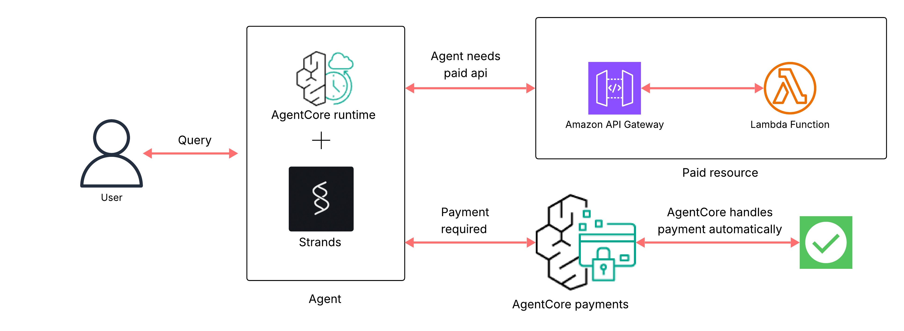
</div>

**Numbered flow (matches the diagram)**

1. **User** sends a query to the **Agent** (AgentCore Runtime + Strands).
2. The agent calls the paid API hosted on **Amazon API Gateway** → **AWS Lambda**.
3. The seller responds with **HTTP 402 Payment Required** and a payment requirement payload.
4. The agent forwards the requirement to **AgentCore Payments**, which selects the
   matching `PaymentInstrument`, checks the session budget, and signs the payment
   through the configured wallet provider (Coinbase CDP or Stripe via Privy).
5. The agent retries the request with the signed `X-PAYMENT` header. The seller
   verifies, settles on-chain through the x402 facilitator, and returns **200 OK** with the content.
6. The agent answers the user. The operator audits spend through `GetPaymentSession`.

### Use Case Key Features

* Agent is designed not to hold private keys — AgentCore Payments
  signs every charge via the configured `PaymentManager` and
  `PaymentConnector`
* Wallet-provider-agnostic — the same agent code runs against a Coinbase CDP
  instrument or a Stripe-via-Privy instrument
* Human-controlled budget via `maxSpendAmount` on the payment session
* IAM role separation: `ManagementRole` creates sessions, `ProcessPaymentRole` signs
  payments (explicit `Deny` in both directions, enforced by IAM rather than
  documentation)
* Full audit trail via `GetPaymentSession` — the operator sees exactly what the
  agent spent
* Self-contained — the script runs from a clean AWS account

---

## Payment Protocol Availability

AgentCore Payments supports multiple wallet providers. The wire format
(x402 for crypto settlement) is an implementation detail. The agent
code in this use case does not change based on provider. The service
picks the right signer from the connector tied to the instrument.

| Wallet Provider | Connector Type | Status | Notes |
|:----------------|:---------------|:-------|:------|
| **Coinbase CDP** | `CoinbaseCDP` | ✅ Available — EVM + Solana | API Key ID, API Key Secret, Wallet Secret. **Enable "Delegated signing"** under Project → Wallet → Embedded Wallets → Policies before use. Inline setup in §5 provisions a Coinbase CDP wallet. |
| **Stripe** (via Privy) | `StripePrivy` | ✅ Available — EVM + Solana | App ID, App Secret, Authorization Key ID, P-256 Authorization Private Key. Privy returns the private key prefixed with `wallet-auth:` — **strip the prefix** before storing it. Inline setup in §5 provisions a Privy-backed wallet. No hub redirect is needed for Privy: the authorization key registered on the credential provider is the signing delegation. |

---

## Prerequisites

- **AWS account** with Amazon Bedrock AgentCore Payments available in your chosen region
- **Amazon Bedrock access** enabled for **Anthropic Claude Sonnet 4.5** in your chosen region (cross-region inference profile `us.anthropic.claude-sonnet-4-5-20250929-v1:0`)
- **Python 3.10+**
- **AWS Command Line Interface (AWS CLI) v2** configured with credentials (`aws configure`)
- **AWS Cloud Development Kit (CDK) v2** installed globally (`npm install -g aws-cdk`); used to deploy the seller and the agent runtime
- **Node.js 18+** — required by CDK
- **A wallet provider account** — Coinbase Developer Platform (CDP) (API Key ID, API Key Secret, Wallet Secret) or Stripe via Privy (App ID, App Secret, Authorization Key ID, P-256 Authorization Private Key)
- **Testnet USD Coin (USDC)** from the [Circle testnet faucet](https://faucet.circle.com/) on both **Base Sepolia** and **Solana Devnet**, because §5 creates one wallet per network

---

## Security

The use case relies on AgentCore Identity's **payment credential provider**
to manage wallet provider secrets. Once `CreatePaymentCredentialProvider`
runs in §4, AgentCore Identity stores the Coinbase / Privy API keys, app
secrets, and wallet or authorization secrets in **AWS Secrets Manager**,
encrypts them with **AWS Key Management Service (KMS)** keys, and surfaces
only the secret ARN to your agents (see [Configure credential
provider](https://docs.aws.amazon.com/bedrock-agentcore/latest/devguide/resource-providers.html)).
The agent runtime calls `GetResourcePaymentToken` at signing time to
receive a short-lived vendor-specific token; it never sees the raw API key
or wallet secret.

What AgentCore Payments handles for you:

- **Secret storage** — wallet provider secrets land in AWS Secrets Manager
  under AgentCore Identity, encrypted with AWS-owned KMS keys (customer-
  managed KMS keys supported)
- **Secret retrieval** — agents call `GetResourcePaymentToken` and receive a
  vendor token. The agent runtime never receives the underlying API key,
  app secret, or wallet secret
- **Audit trail** — every `ProcessPayment` call writes to AWS CloudTrail
  and to the AgentCore Payments managed log group. Use `GetPaymentSession`
  for operator-visible spend totals
- **Budget enforcement** — the operator sets `maxSpendAmount` on the
  payment session. AgentCore Payments rejects any `ProcessPayment` that
  would exceed it
- **IAM least privilege** — the four roles in §2 each receive only the
  actions and resources required for one operation. Cross-role permissions
  are explicitly denied (`ManagementRole` cannot call `ProcessPayment`,
  `ProcessPaymentRole` cannot manage sessions or instruments)

What you handle locally:

- **Initial credential paste** — Coinbase / Privy secrets are pasted into
  `.env` once, before §4 runs. The script reads them only to call
  `CreatePaymentCredentialProvider`. After that call returns, the secrets
  are inside the AgentCore Identity-managed vault (Secrets Manager) and
  the local `.env` copies are no longer needed by the agent. They remain
  in `.env` so re-running §4 is idempotent
- **Encryption in transit** — all calls to AgentCore Payments, Amazon
  Bedrock, and the seller HTTP API run over TLS (`https://`). The
  Dockerfile health check is the only HTTP URL and is loopback-only

### Production hardening

This is an L100 tutorial. Before deploying anything resembling this
sample to production:

- **Drop `.env` after first run.** Once §4 has called
  `CreatePaymentCredentialProvider`, blank the secret values from `.env`.
  Subsequent script runs read the credential provider ARN from `.env`
  (which is non-sensitive) and the actual secrets stay in Secrets Manager
- **Use customer-managed KMS keys.** AgentCore Identity defaults to
  AWS-owned KMS keys; switch to customer-managed keys for additional
  audit and rotation control
- **Tighten IAM role wildcards.** Once Manager IDs are stable, replace
  `payment-manager/*` with the specific Manager ARN, or scope by tag
- **Switch the AgentCore Runtime to VPC mode** with private subnets and
  VPC endpoints for AWS APIs (the tutorial uses `networkMode=PUBLIC`)
- **Restrict the seller's Amazon API Gateway CORS** to the specific agent
  runtime domains that need to call it
- **Pin the `bedrock-agentcore` Python SDK and `@x402/*` Node packages**
  to specific versions in production builds

---

## Running the Use Case

This use case ships as a single Python script, `pay_for_api.py`, plus
the CDK apps for the seller (`seller/cdk/`) and agent runtime
(`agent/cdk/`) and three idempotent shell scripts under
`test/integration/` for IAM, environment, and seller deploy.

**Step 1.** Create a Python virtual environment and install dependencies.
The script requires Python **3.10+**, so create the venv with an explicit
3.10+ binary (the macOS system `python3` is 3.9):

```bash
python3.12 -m venv .venv     # or python3.10 / python3.11; any 3.10+
source .venv/bin/activate    # On Windows: .venv\Scripts\activate
python3 -m pip install -r requirements.txt
```

**Step 2.** Seed `.env` from the template, then open it in your editor
and fill in:

```bash
cp env-sample.txt .env
```

- `INSTRUMENT_EMAIL`
- `SELLER_WALLET_ADDRESS`, `SELLER_SOLANA_WALLET_ADDRESS`
- `COINBASE_API_KEY_ID`, `COINBASE_API_KEY_SECRET`, `COINBASE_WALLET_SECRET`
- `PRIVY_APP_ID`, `PRIVY_APP_SECRET`, `PRIVY_AUTHORIZATION_ID`, `PRIVY_AUTHORIZATION_PRIVATE_KEY` (skip if you only configured Coinbase)

The seller and the script need these values before Step 5.

**Step 3.** Create the four IAM roles (idempotent; writes ARNs into `.env`):

```bash
bash test/integration/setup-roles.sh
```

**Step 4.** Generate `USER_ID` (idempotent; no-op if already set):

```bash
bash test/integration/setup-env.sh
```

### Step 5: Run the script

```bash
python pay_for_api.py
```

§3 of the script runs `bash test/integration/deploy-seller.sh` for you
on the first run — it writes `SELLER_API_URL` into `.env` and then
sanity-checks the seller. Subsequent runs detect the existing
`SELLER_API_URL` and skip the deploy. If you change
`SELLER_WALLET_ADDRESS` or `SELLER_SOLANA_WALLET_ADDRESS` in `.env`,
either blank `SELLER_API_URL` first or run
`bash test/integration/destroy-seller.sh && bash test/integration/deploy-seller.sh`
manually before re-running the script.

The script runs §3 (sanity-check the seller) through §10 end-to-end.
§6, §8, and §10 each pause for confirmation:

- §6 — pauses twice for signing delegation (Coinbase, then Privy). The
  script opens each hub in your browser, waits for you to grant
  delegation, and continues when you press Enter.
- §8 — prompts before deploying the agent to AgentCore Runtime. Press
  Enter to deploy and invoke; press `q` and Enter to skip.
- §10 — prompts before tearing down resources. Press Enter to clean
  up; press `q` and Enter to keep the resources for further
  exploration.

#### §6a — Coinbase Wallet Hub delegation

When the script reaches §6a, it prints the Coinbase Wallet Hub URL
returned by `CreatePaymentInstrument` and opens it in your default
browser. Without this delegation grant, `ProcessPayment` returns
*Delegated signing grant is not active*.

In the hub:

1. **Sign in** with the email you set as `INSTRUMENT_EMAIL`. The hub
   sends a one-time passcode (OTP) to that address.

<div style="text-align:left">
    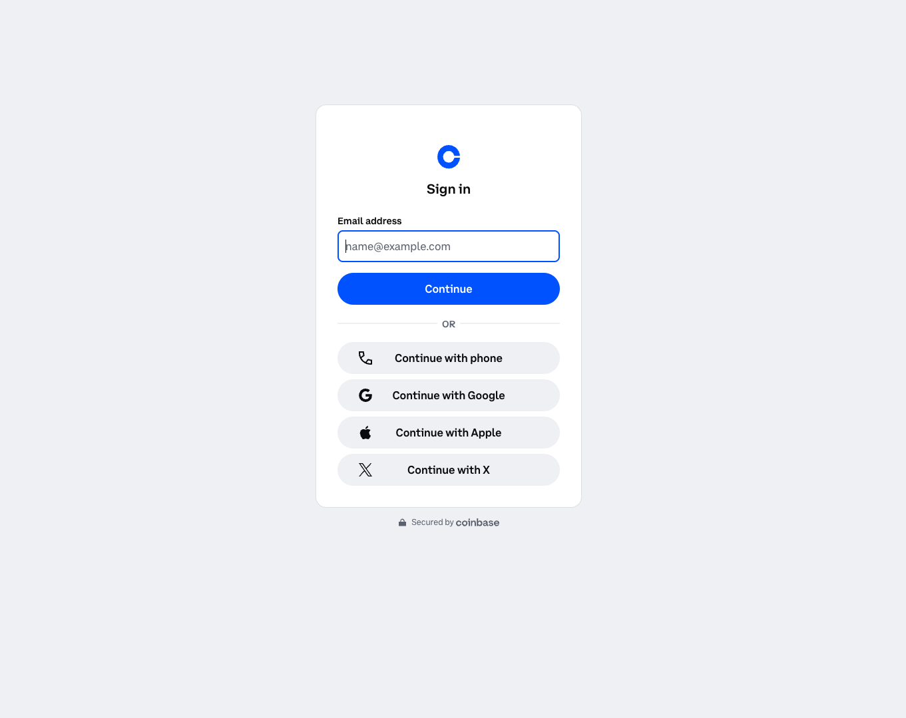
</div>

2. **Enter the OTP** in the hub.

<div style="text-align:left">
    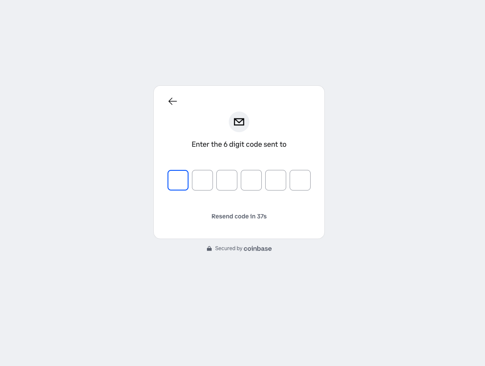
</div>

3. **Grant signing delegation** to the agent.
4. **Set the delegation duration** — how long the grant should remain
   active.

<div style="text-align:left">
    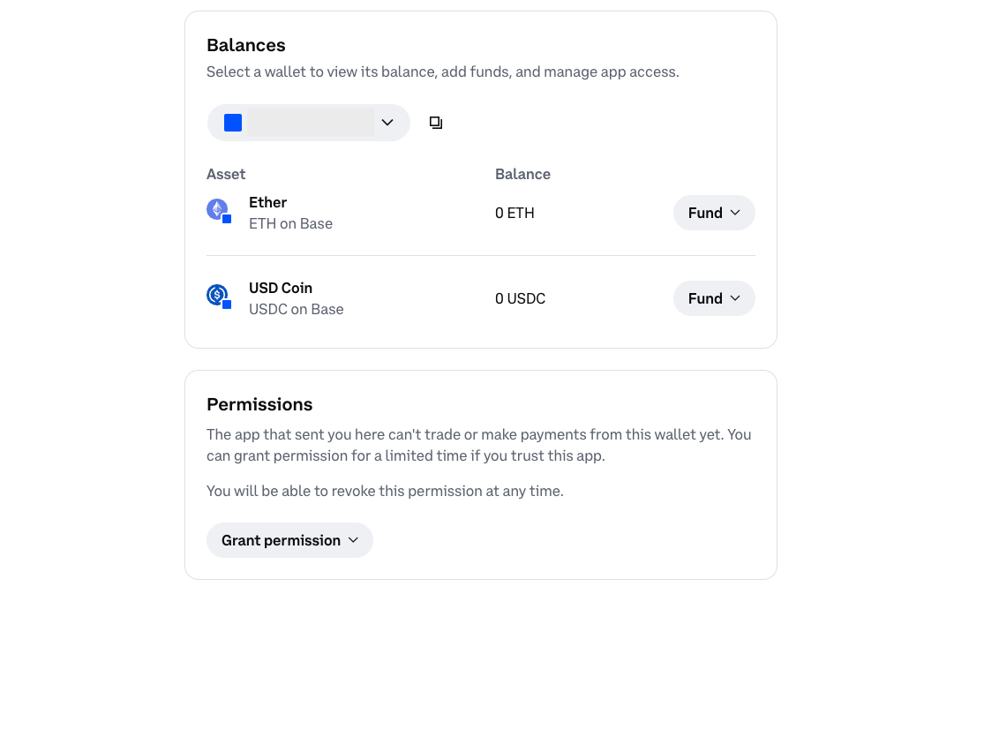
</div>

5. **Copy the EVM wallet address** printed by the script.
6. **Request testnet USDC** from the
   [Circle Faucet](https://faucet.circle.com/) on **Base Sepolia**
   using the copied address.
7. **Toggle to Solana** in the hub, switch to **Solana Devnet**,
   copy the Solana wallet address, and request testnet USDC from
   the same faucet.

Return to the terminal and press Enter to continue. Skip §6a entirely
on re-runs by setting `CDP_DELEGATION_GRANTED=1` in `.env`.

#### §6b — Privy Wallet Hub delegation

Privy embedded wallets need a separate signing delegation. The
delegation flow runs through a small Next.js frontend maintained
jointly by Privy and AWS at
[privy-io/aws-agentcore-sdk](https://github.com/privy-io/aws-agentcore-sdk).
The script clones the frontend, runs `npm install`, writes
`.env.local` from the Privy values already in your `.env`, starts
`npm run dev`, and opens `http://localhost:3000` in your browser.
Skip this step entirely (no Privy creds in `.env`) and the script
moves on to §7 with only the Coinbase wallets active.

In the hub:

1. **Log in** with the email you set as `INSTRUMENT_EMAIL`. Privy
   sends a one-time passcode (OTP) to that address.

<div style="text-align:left">
    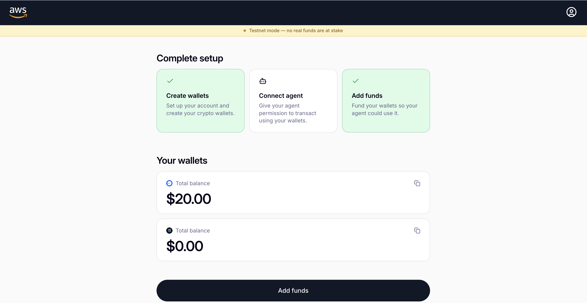
</div>

2. **View your wallets.** The hub queries Base Sepolia and Solana
   Devnet directly and shows USDC balances for both.
3. **Delegate access to the agent.** Choose **Delegate** for each
   wallet you want the agent to spend from.

<div style="text-align:left">
    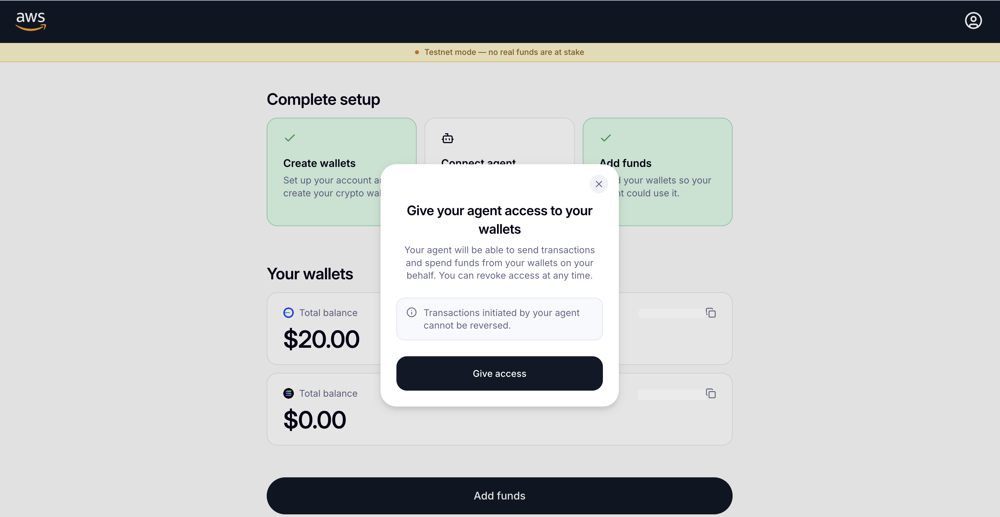
</div>

4. **Choose Receive** in the hub to copy each wallet address.
5. **Request testnet USDC** from the
   [Circle Faucet](https://faucet.circle.com/) on **Base Sepolia** or
   **Solana Devnet** using the copied address. Card funding through
   Stripe is mainnet-only and is disabled when
   `NEXT_PUBLIC_NETWORK_MODE=testnet`.

Return to the terminal and press Enter to continue. The script stops
the Privy frontend, sets `PRIVY_DELEGATION_WIRED_UP=1` in this process,
and continues to §7. Skip §6b entirely on re-runs by setting
`PRIVY_DELEGATION_WIRED_UP=1` in `.env`.

After the first run completes, the runtime exists in the console.
Enable Transaction Search and re-run the script (the script is
idempotent and will replay only the §7 / §8 invocations against the
existing runtime) to populate the observability dashboard.

#### Enable Transaction Search (one-time, console step)

Transaction Search powers the **Observability** tab on the runtime
page. This is a one-time setup per runtime.

1. Open the **Amazon Bedrock AgentCore** console → **Runtime**.
2. Choose **`pay_for_api_agent_runtime`** in the list.

<div style="text-align:left">
    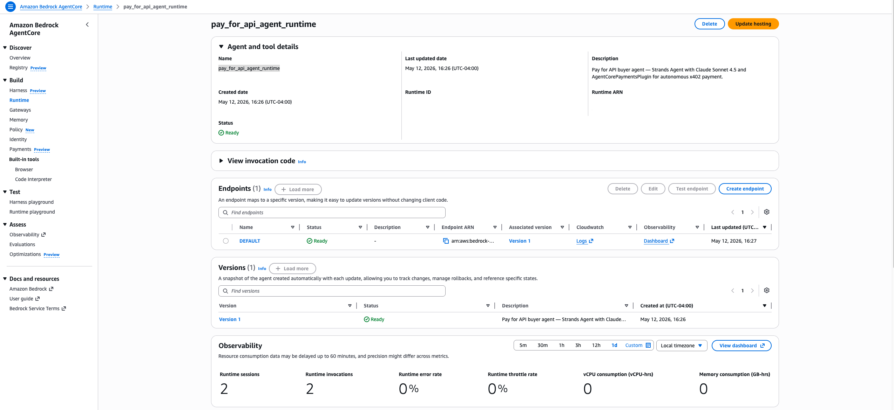
</div>

3. Open the **Log deliveries and tracing** tab.
4. Enable **Transaction Search**.
5. Choose **Save**.

<div style="text-align:left">
    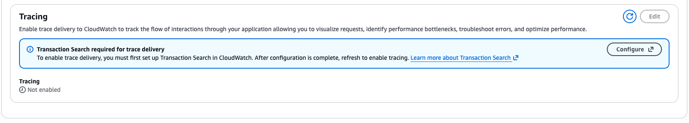
</div>

After saving, the panel confirms Transaction Search is enabled:

<div style="text-align:left">
    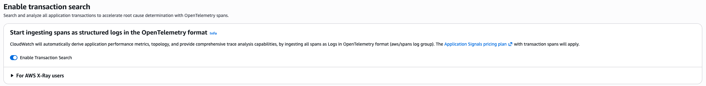
</div>

> Transaction Search takes a few minutes to start indexing after you
> save. If the Observability tab shows no data immediately, wait a
> minute and refresh.

Re-run the script to generate fresh invocations that Transaction
Search will capture:

```bash
python pay_for_api.py
```

The script is idempotent, so it skips the deploy and replays only
§7 / §8 invocations against the existing runtime.

#### Inspect the runtime in the console

After the second run returns, open the AgentCore console to see
the underlying spans and logs.

1. From the runtime detail page, choose **View dashboard** in the
   **Observability** section.

<div style="text-align:left">
    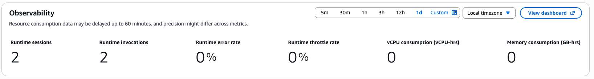
</div>

2. The CloudWatch GenAI Observability dashboard opens. Open the
   **Sessions** tab and choose the most recent **Session ID**.

<div style="text-align:left">
    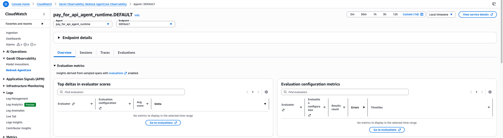
</div>

3. Choose the most recent **Trace ID** to explore the
   `POST /invocations` events: model invocations, tool calls,
   payment requirement (`402`), `ProcessPayment` span, and the
   final retry that returns `200 OK`.

<div style="text-align:left">
    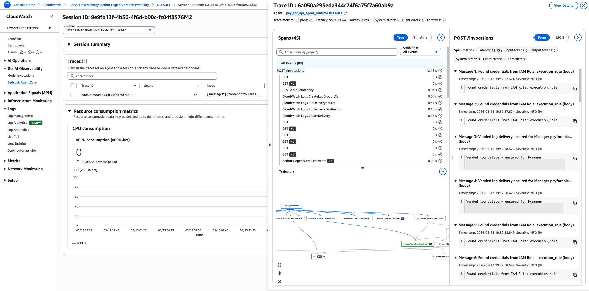
</div>

The script is **idempotent**. Resource IDs are written back into `.env`
after each provisioning step, so subsequent runs detect them and skip
the `Create*` calls. Re-run after editing `.env` to retry without
rebuilding.

`pay_for_api.py` runs through these sections:

- **§1** — handled out of band by `pip install -r requirements.txt`
- **§2** — `setup-roles.sh` + `setup-env.sh` create the IAM roles and seed `.env`. Wallet provider credentials are pasted into `.env` by the operator.
- **§3** — runs `bash test/integration/deploy-seller.sh` on the first run to deploy the Fun Facts seller (Amazon API Gateway + AWS Lambda), then sanity-checks the seller and previews the 402 response
- **§4** — assume IAM roles, create the two Credential Providers, Manager, two Connectors, and four Instruments
- **§5** — create two budget-limited payment sessions
- **§6** — grant signing delegation: §6a opens the Coinbase Wallet Hub in your browser; §6b clones, installs, and runs the Privy delegation Next.js frontend on `http://localhost:3000`. The script waits for you to press Enter after each grant before continuing.
- **§7** — run the agent four times locally (CDP × Privy, EVM × Solana)
- **§8** — prompts before running `bash test/integration/deploy-agent.sh` to build and deploy the agent to AgentCore Runtime via CodeBuild. After deploy, invokes the runtime once per (provider, network). Press Enter to deploy, q to skip
- **§9** — inspect data plane: `GetPaymentSession` (running budget), `GetPaymentInstrumentBalance` (on-chain USDC), `ListPaymentInstruments`, `ListPaymentSessions`
- **§10** — prompts before tearing down sessions, instruments, connectors, manager, and credential providers, plus running `destroy-seller.sh` / `destroy-agent.sh` and removing local build artifacts. Press Enter to clean up, q to keep resources

---

## Key Notes

- The seller stack deploys to the same region as AgentCore Payments —
  set by `AWS_REGION` in `.env`.
- USDC amounts use 6 decimal places: `"$0.01"` → `10000` atomic units
  on the wire. The `@x402/hono` library handles the conversion.
- The seller emits multi-network `accepts` — one entry for EVM
  (Base Sepolia) and one for Solana (Devnet) when both payout wallets
  are configured. The agent picks the entry matching the instrument's
  network.
- Responses use the `{ x402_content, x402_meta }` shape so the seller
  is discoverable through the AgentCore Registry / Bazaar Model
  Context Protocol (MCP).
- The `ProcessPaymentRole` has an explicit IAM `Deny` on all session
  and instrument management; the `ManagementRole` has an explicit
  `Deny` on `ProcessPayment`. The trust boundary is enforced by IAM,
  not by documentation.
- The seller verifies payment proofs against the public x402
  facilitator (`https://x402.org/facilitator`). Point it at a private
  facilitator by editing `seller/lambda/index.js` and redeploying.
- When a `StripePrivy` instrument is used, the agent and the seller do
  not change. AgentCore Payments routes the signing request to Privy's
  key-management service transparently. Privy-backed instruments
  settle on both EVM (Base / Base Sepolia) and Solana (Solana / Solana
  Devnet).
- The agent never calls the plugin's read-only management tools
  (`get_payment_instrument`, `list_payment_instruments`,
  `get_payment_session`). Those are reserved for operator debug flows.
  The system prompt in §7 tells the model to use only `http_request`.

---

## Cleanup

> ⚠️ **Cost notice:** The resources deployed in this use case incur
> AWS charges while running. AWS Lambda, Amazon API Gateway, AgentCore
> Runtime, AgentCore Memory, and AgentCore Payments all bill on
> per-request and per-resource models. Run cleanup when you are done.

After §9, `pay_for_api.py` prompts for cleanup. Press Enter to run §10
end-to-end, or press `q` and Enter to keep the resources for further
exploration.

§10 cleans up everything in the right order:

| Step | What it does | What it removes |
|------|--------------|-----------------|
| Revoke sessions | `DeletePaymentSession` on each session created in §5 | Active session budgets (no undelete) |
| Tear down AgentCore Payments resources | `DeletePaymentInstrument`, `DeletePaymentConnector`, `DeletePaymentManager`, `DeletePaymentCredentialProvider` in dependency order | All Manager, Connector, Instrument, and Credential Provider resources created by §4 |
| Tear down the seller stack | Runs `bash test/integration/destroy-seller.sh` (`cdk destroy` on the seller CDK app) | Amazon API Gateway HTTP API, AWS Lambda function, IAM execution role |
| Tear down the agent runtime | Runs `bash test/integration/destroy-agent.sh` (only if §8 ran) | AgentCore Runtime, AgentCore Memory, Amazon ECR repository, AWS CodeBuild project, IAM execution role |
| Remove local build artifacts | Deletes `seller/cdk/.venv`, `seller/cdk/cdk.out`, `seller/lambda/node_modules`, `agent/cdk/.venv`, `agent/cdk/cdk.out`, `__pycache__/`, `outputs.json`, and `privy-delegation/` | Local working-copy files only — no cloud resources |

The IAM roles created by `setup-roles.sh` have no standing cost and
are retained for re-runs. To delete them by hand:

```bash
aws iam delete-role --role-name AgentCorePaymentsControlPlaneRole
aws iam delete-role --role-name AgentCorePaymentsManagementRole
aws iam delete-role --role-name AgentCorePaymentsProcessPaymentRole
aws iam delete-role --role-name AgentCorePaymentsResourceRetrievalRole
```

CloudWatch log groups under `/aws/bedrock-agentcore/` and `/bedrock-agentcore/payments/`
are retained after teardown so you can review historical traces. Delete
them from the CloudWatch console if you want to clear historical data.

### Verify cleanup succeeded

Confirm no CloudFormation stacks remain:

```bash
aws cloudformation list-stacks \
    --stack-status-filter CREATE_COMPLETE UPDATE_COMPLETE \
    --query "StackSummaries[?starts_with(StackName, 'AgentCorePayments')].StackName"
```

The output should be empty.

---

## Conclusion

This use case demonstrates how Amazon Bedrock AgentCore Payments
enables an AI agent to make autonomous micropayments for paid HTTP APIs
without holding private keys or requiring per-transaction human
approval. The same agent code paid for the same content through two
different wallet providers (Coinbase CDP and Stripe via Privy) and on
two different networks (EVM and Solana), demonstrating the
provider-agnostic and network-agnostic design.

Key takeaways:

- **Separation of concerns** — IAM roles isolate session creation,
  payment signing, and credential retrieval. The trust boundary is
  enforced by IAM, not by code.
- **Budget control** — operators set a maximum spend per session.
  AgentCore Payments enforces it, and `GetPaymentSession` provides a
  full audit trail.
- **Wire format** — x402 (HTTP 402 Payment Required) is the open spec
  on the wire. The `@x402/hono` library on the seller side and the
  `AgentCorePaymentsPlugin` on the agent side handle the protocol so
  that the application code remains a normal HTTP request.

Use the [Learn more](#learn-more) links to go deeper, and adapt the
patterns in this use case to your own paid-API integrations.

---

## Learn more

Public AgentCore Payments documentation:

- [Overview](https://docs.aws.amazon.com/bedrock-agentcore/latest/devguide/payments.html)
- [How it works](https://docs.aws.amazon.com/bedrock-agentcore/latest/devguide/payments-how-it-works.html)
- [Core concepts](https://docs.aws.amazon.com/bedrock-agentcore/latest/devguide/payments-concepts.html)
- [Prerequisites](https://docs.aws.amazon.com/bedrock-agentcore/latest/devguide/payments-prerequisites.html)
- [IAM roles](https://docs.aws.amazon.com/bedrock-agentcore/latest/devguide/payments-iam-roles.html)
- [Set up a credential provider](https://docs.aws.amazon.com/bedrock-agentcore/latest/devguide/payments-setup-credential-provider.html)
- [Create a payment manager](https://docs.aws.amazon.com/bedrock-agentcore/latest/devguide/payments-create-manager.html)
- [Create a payment instrument](https://docs.aws.amazon.com/bedrock-agentcore/latest/devguide/payments-create-instrument.html)
- [Create a payment session](https://docs.aws.amazon.com/bedrock-agentcore/latest/devguide/payments-create-session.html)
- [Process a payment](https://docs.aws.amazon.com/bedrock-agentcore/latest/devguide/payments-process-payment.html) — plugin reference, interrupt contract, network preferences, `auto_payment=False` for human-in-the-loop flows
- [Connect to Bazaar](https://docs.aws.amazon.com/bedrock-agentcore/latest/devguide/payments-connect-bazaar.html) — make a seller discoverable through the AgentCore Registry

Announcement:
[Agents that transact — Introducing Amazon Bedrock AgentCore Payments, built with Coinbase and Stripe](https://aws.amazon.com/blogs/machine-learning/agents-that-transact-introducing-amazon-bedrock-agentcore-payments-built-with-coinbase-and-stripe/)
